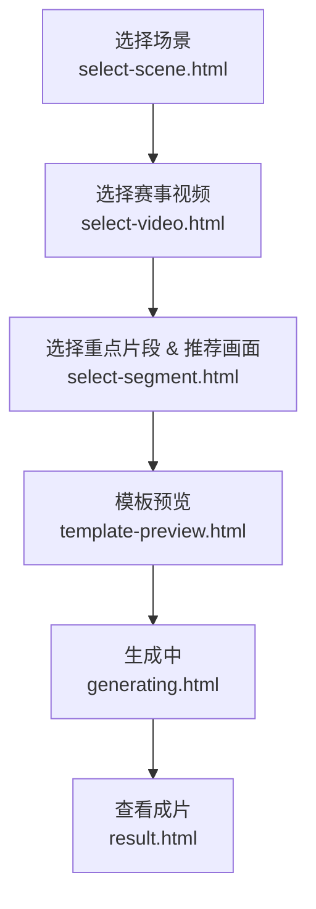
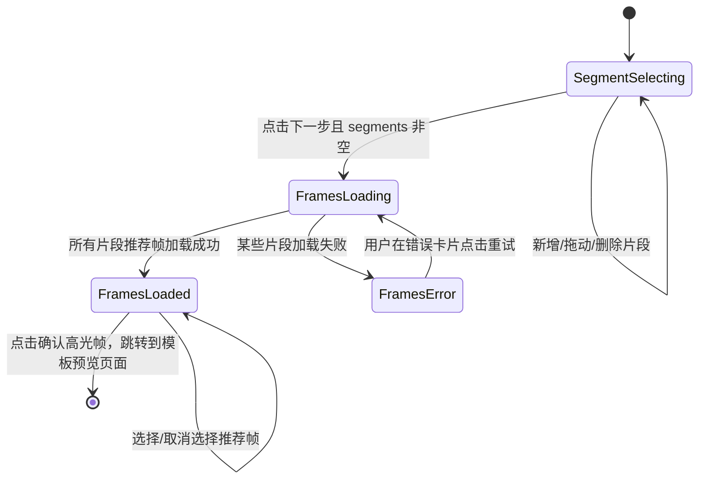

## 赛事视频 · 选片段 & 选高光帧流程

本说明对应 `select-video → select-segment → template-preview → generating → result` 整体链路，重点拆解「先选重点片段，再推荐高光帧」的两阶段交互。

---

## 一、整体用户流程

---

## 二、阶段一：选择重点片段（时间轴交互）

- **目标**：在 1 小时左右的长视频里，让用户先圈出 1–N 个「重点片段」，减少直接面对大量模型高光点的负担。
- **主界面元素**：
  - 顶部：当前视频/封面图预览（静态占位或真实播放器）。
  - 中部：带刻度的时间轴和可拖拽的彩色区间条（Segment）。
  - 底部：操作区，包含「+ 新增重点片段」「重置全部」「下一步：选择推荐画面」。

### 2.1 状态与数据

- `videoDuration`：当前视频总时长（秒），Demo 固定为 3600。
- `segments: { id: string; start: number; end: number; }[]`
  - 保证 `0 ≤ start < end ≤ videoDuration`。
  - 约束：
    - 单段最短时长：3 秒。
    - 单段最长时长：10 秒（可配置）。
    - 总时长占比上限：例如不超过整段视频的 30%（Demo 中仅做提示，不做硬限制）。

### 2.2 交互细节

- **新增重点片段**
  - 点击「+ 新增重点片段」：
    - 若当前无片段：生成一个位于视频中部的默认片段（例如 [videoDuration/2 - 5, videoDuration/2 + 5]）。
    - 若已有片段：在时间轴空白处查找可以容纳默认长度的位置，找不到则提示「已达到可选重点片段上限」。
- **拖拽调整**
  - 拖拽区间中部：整体平移片段，吸附到 1 秒粒度边界。
  - 拖拽左右两端：伸缩片段，两端显示起止时间的悬浮提示。
  - 所有操作都需要进行边界和最短时长校验，非法操作自动回弹到最近合法位置。
- **删除**
  - 每个片段右上角提供「×」按钮，可删除该片段。

### 2.3 空态 / 加载态 / 异常态

- **空态**：无 `segments` 时展示引导文案，如「拖动或点击下方按钮，新建一个重点片段」。
- **加载态**：阶段一主要是本地交互，不涉及网络加载，无特殊加载态。
- **异常态**：当片段总长度超出建议比例、或片段重叠时，在时间轴下方以浅灰小字提示说明（不阻断操作）。

---

## 三、阶段二：重点片段内推荐高光帧

- **目标**：在用户圈定的每个重点片段内，展示 3–5 张由端侧模型推荐的高光帧，帮助快速确认最终参考画面。
- **主界面元素**：
  - 段列表：每个重点片段一张卡片，标题展示「重点片段 N（起–止）」。
  - 片段预览条：位于卡片顶部的小型缩略 strip。
  - 推荐帧宫格：卡片主体展示若干张推荐帧，可多选。
  - 底部 CTA：「确认高光帧」，需要至少选中一张推荐帧后才可点击。

### 3.1 状态与数据

- 输入：
  - `segments`（来自阶段一）。
  - `videoId`、`template` 等上下文信息。
- 模型返回（建议结构）：
  - `segmentFrames: { segmentId: string; frames: { time: number; score: number; faceScore?: number; motionScore?: number; thumbnailUrl: string; }[] }[]`
- 前端本地选择状态：
  - `selectedFrames: { [segmentId: string]: { time: number; thumbnailUrl: string; }[] }`

### 3.2 交互细节

- **加载推荐帧**
  - 进入阶段二后，按片段并行请求模型；Demo 中用本地 mock 函数生成推荐帧。
  - 加载中：每个片段卡片显示 skeleton 或「正在为你挑选高光帧…」。
  - 加载完成：展示 Top-N 帧缩略图，按评分排序，默认不选中。
- **选择帧**
  - 点击缩略图：在该缩略图上打勾并高亮边框，再次点击取消。
  - 支持每个片段多选；若某片段未选任何帧，只要全局至少有 1 张已选帧，也允许继续，但推荐在文案中提示「建议每个片段至少选择 1 张」。
- **查看大图 / 跳转时间**
  - Demo 保留为点击态效果；后续接入真实播放器时，点击帧可把主播放器跳转到对应时间。

### 3.3 空态 / 加载态 / 异常态

- **空态**：如果某个片段模型返回 `frames.length === 0`：
  - 卡片内展示「该片段未找到明显人脸或大幅动作，建议稍微调整片段范围」。
  - 不阻止用户提交，只是不推荐该片段的参考图。
- **加载态**：统一骨架屏/占位图，避免列表跳动。
- **异常态**：
  - 网络 / 模型失败：在卡片内展示错误提示和「重试」按钮，仅重新请求该片段的数据。

---

## 四、提交与与后续页面的参数约定

- **本地存储（sessionStorage）键值建议**：
  - `aigc_segments`：字符串化的 `segments`。
  - `aigc_segment_frames`：字符串化的模型返回 `segmentFrames`。
  - `aigc_selected_frames`：字符串化的用户选择结果。
  - `aigc_video_id`：选中的视频 ID（沿用现有字段）。
  - `aigc_frame_ts`：第一个选中高光帧的时间戳（兼容现有「确认一帧」流程）。
  - `aigc_reference_image`：对应高光帧的图像数据或占位图 URL（若未生成 dataURL，则沿用当前占位图）。
- **页面跳转约定**：
  - `select-segment.html` 提交后跳转到 `template-preview.html`，带上：
    - `template`
    - `videoId`
    - `frameTs`（取第一个选中帧的时间）
    - `from=segments`（用于 `template-preview.html` 决定返回按钮从哪里返回）。
  - `template-preview.html` 再跳转到 `generating.html` 时，将 `frameTs` 透传，`generating.html` 继续透传到 payload 中给后端。

---

## 五、前端状态机概览

以上为当前 Demo 版本的交互与状态设计，将在 `select-segment.html` 中以纯前端方式实现，后续可以无缝切换到真实模型接口。

